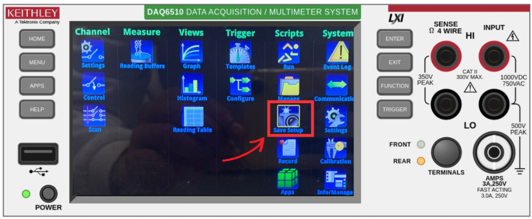

# la procédure d’ajout d’un canal de mesure sur le Keithley :

### Sécurité Éteindre complètement le Keithley avant tout démontage.

## juste a la fin hajar ; 

Sauvegarde de la configuration
Dès que la configuration est terminée, il est recommandé de l’enregistrer pour pouvoir la réutiliser lors d’un prochain test.

